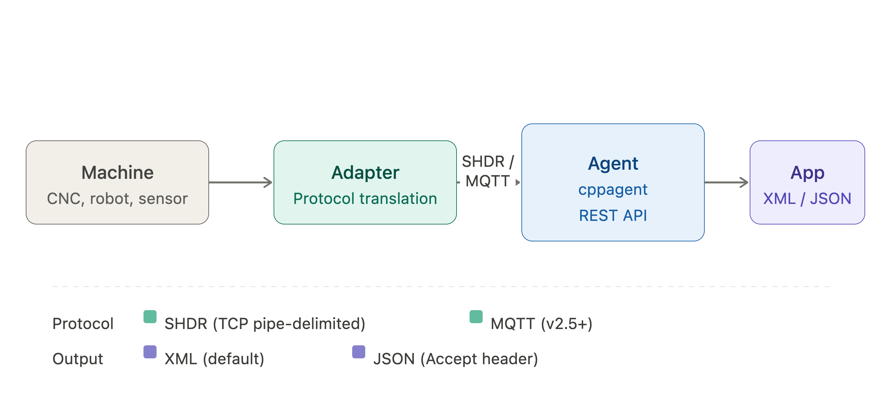

MTConnect uses a three-tier architecture: **Device → Adapter → Agent → Client**.

## Architecture Overview



## The Agent

The Agent is the central hub. It accepts data from one or more adapters over TCP, buffers it in a circular buffer, and serves it to clients over a **REST API**. The reference implementation is the open-source [C++ Agent](https://github.com/mtconnect/cppagent).

## Adapters

Adapters connect machines to the Agent, translating raw machine signals into one of two protocols:

**SHDR (Simple Hierarchical Data Representation)** — the classic protocol, sent over a TCP socket as pipe-delimited strings:

```
2024-01-15T10:23:45.000Z|Smode|AUTOMATIC
2024-01-15T10:23:45.001Z|S1speed|3500.0
2024-01-15T10:23:45.001Z|path_pos|100.5|200.3|0.0
```

**MQTT** — a modern pub/sub alternative supported from MTConnect v2.5+, useful for cloud-connected or IoT deployments.

## REST API Endpoints

The Agent exposes a REST API over HTTP. Clients make standard `GET` requests and receive structured **XML** (default) or **JSON** responses:

| Endpoint | Description |
|----------|-------------|
| `GET /probe` | Device structure and metadata |
| `GET /current` | Latest snapshot of all data items |
| `GET /sample` | Sequence of observations from the buffer |
| `GET /assets` | Retrieve assets (e.g. cutting tools) |

<Tip>
  All endpoints support content negotiation — add `Accept: application/json` to your request header to receive JSON instead of XML.
</Tip>